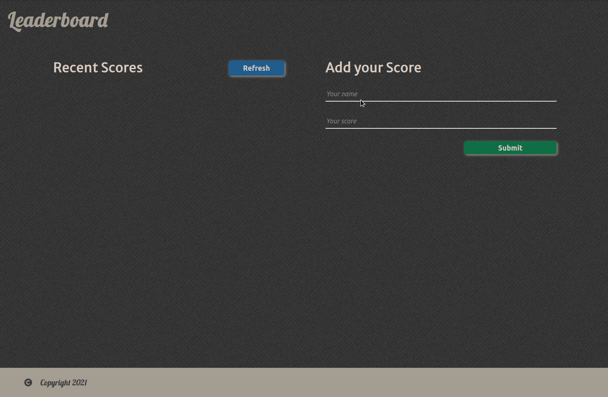

# LeaderBoard

> A web application that displays scores submitted by different players.



## Built With

- JavaScript
- Html/Css
- webpack
## Live Demo

[Live Demo Link](https://benwmx.github.io/LeaderBoard/)


## Getting Started
to get this application in your local machine, follow the instructions below.

### Prerequisites
you need first to have the nodejs and npm installed in order to run the application, because the application uses webpack to bundle the modules and gh-pages the application to deploy it to Github pages.

* install [nodejs](https://nodejs.org/en/) follow the steps in the link.
* install [npm](https://docs.npmjs.com/about-npm)
* run this command to install the needed node packages

  ``` npm install --save-dev webpack webpack-cli html-webpack-plugin style-loader css-loader webpack-dev-server gh-pages ```

### Clone 

``git clone https://github.com/benwmx/LeaderBoard.git ``

### Build
to build the project with webpack after committing your changes run this command

``` npm run build ```
### Deployment
to deploy the application to github pages run this command.
``` npm run deploy ```

## Authors

👤 **Rachid Boudaoudi**

- GitHub: [@benwmx](https://github.com/benwmx)
- Twitter: [@ben_wmx](https://twitter.com/ben_wmx)
- LinkedIn: [LinkedIn](https://linkedin.com/in/linkedinhandle)

## 🤝 Contributing

Contributions, issues, and feature requests are welcome!

Feel free to check the [issues page](../../issues/).

## Show your support

Give a ⭐️ if you like this project!

## Acknowledgments

- Hat tip to anyone whose code was used
- Inspiration
- etc

## 📝 License

This project is [MIT](./MIT.md) licensed.
